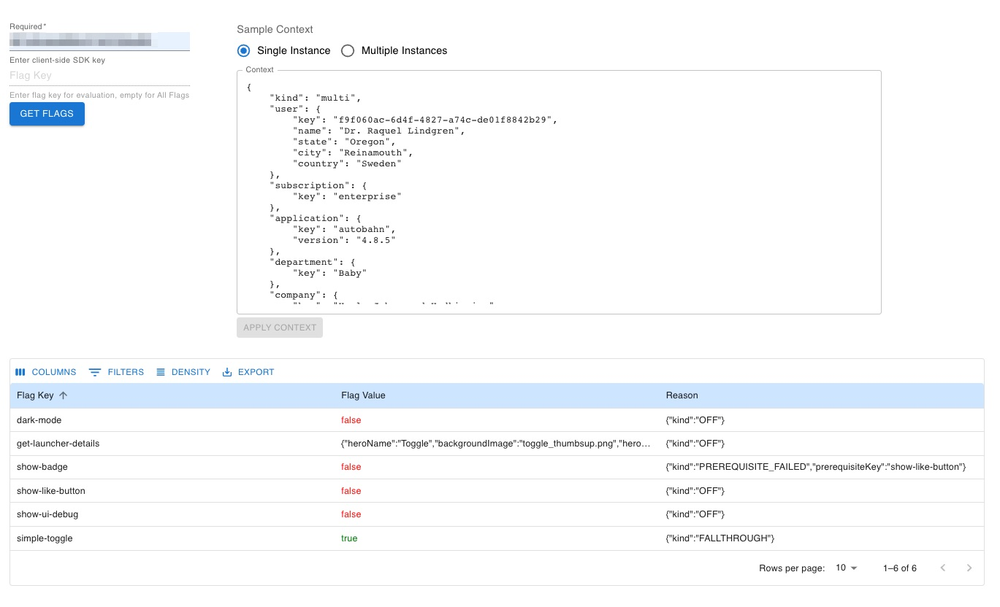
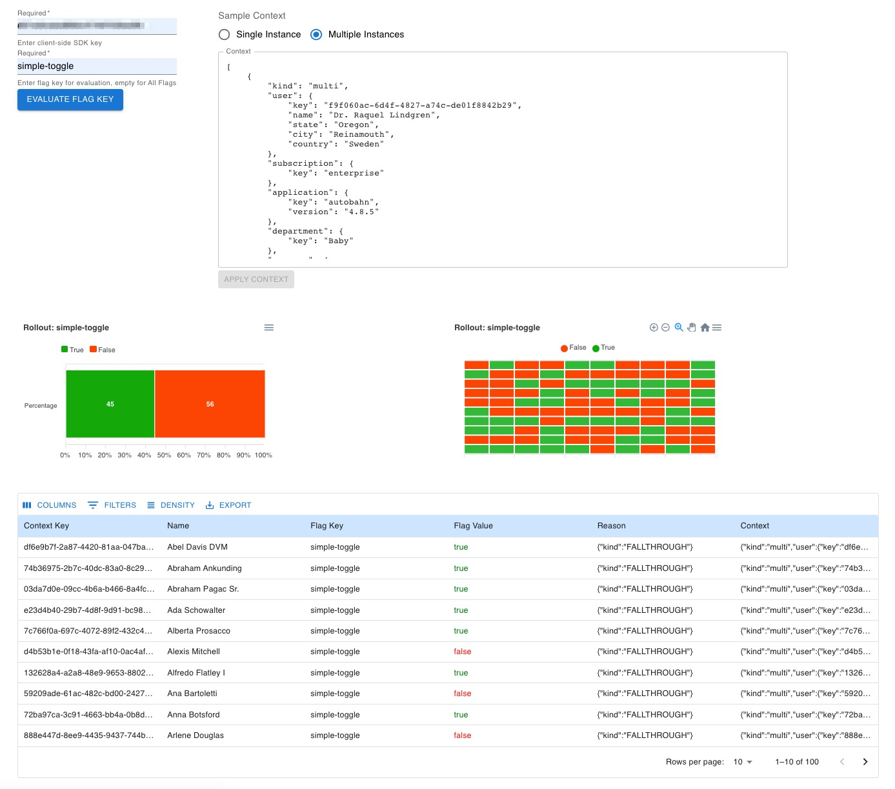
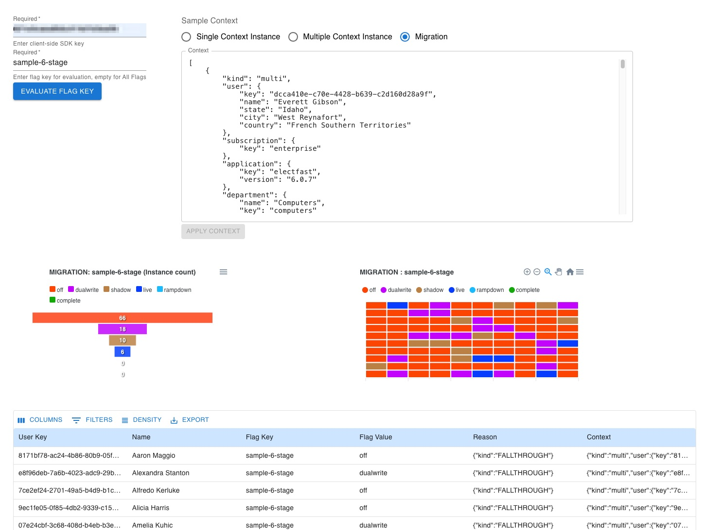

# LaunchDarkly Context Playground
The LaunchDarkly Context Playground is a tool that allows developers to easily design and validate target audiences and rollout strategies.

### Features:
NOTE Only available to feature flags enabled for client-side use like web or mobile SDK.
* Evaluate flag rules and rollout strategy
* Generate a report of contexts and evaluated result

#### `Important`
It is recommended to use separate environments in your Launchardkly project for testing purposes with test data. This ensures that the test data does not get mixed up with your live production data.

## Requirements
* [LaunchDarkly account](https://launchdarkly.com/start-trial/)
* [Client Side ID](https://docs.launchdarkly.com/home/organize/environments/?q=clientside+id#finding-and-resetting-an-environments-sdk-key-mobile-key-or-client-side-id)
* NodeJS >=18.x
* React 18.x


## Instalation
1. Clone this repo.
2. Install dependencies with command:
    ```
    npm install
    ```


## Running the app
#### `IMPORTANT:`
> Use a sandbox Project and Environment when testing with sample data to avoid mixing sample data with live/production data.


`npm start`\
Runs the app in the development mode.\
Open [http://localhost:3000](http://localhost:3000) to view it in your browser.

The page will reload when you make changes.\
You may also see any lint errors in the console.

## Sample data
Sample data was generated using *FakerJS* and can be found in `./src/data.js`.\

To generate sample data using a different/custom schema update and run the script `generateData.js`.

## Features

* Display ALL client side enabled feature flag and values for a [Context](https://docs.launchdarkly.com/home/contexts). To learn more read [Targeting with flags](https://docs.launchdarkly.com/home/flags/targeting) for details.



* Evaluate a flag for multiple Context instances. Return flag value for multiple contexts and [validate rollout strategy](https://docs.launchdarkly.com/home/flags/rollouts).



* Evaluate a migration flag at [cohort level](https://docs.launchdarkly.com/home/flag-types/migration-flags/metrics) indicating migration phase for each individual/cohort.


